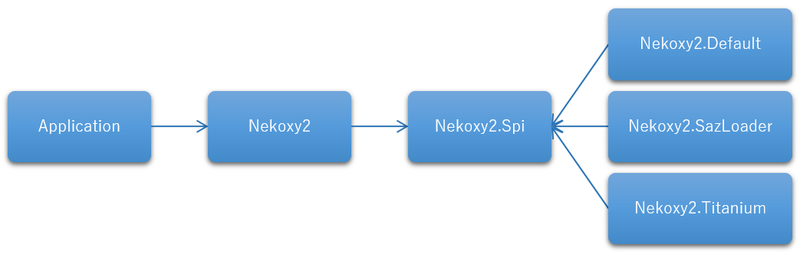

Nekoxy2
================

Nekoxy2 は、共通インターフェイスを定義し、実装を交換可能にした .NET 向けの HTTP プロキシライブラリです。  
[Nekoxy](https://github.com/veigr/Nekoxy) との互換性はありません。

Nekoxy2 は、大きく分けて以下の3種類から構成されています。

* アプリケーションが利用する API
    * Nekoxy2
* プロキシエンジンが実装すべき Provider Interfaces
    * Nekoxy2.Spi
* 既定 / サンプルのプロキシエンジン
    * Nekoxy2.Default
    * Nekoxy2.SazLoader
    * Nekoxy2.Titanium




アプリケーションは、API と使いたいプロキシエンジンを参照し Nekoxy2 を利用します。

```C#
// 既定のプロキシエンジンを作成
var engine = DefaultEngine.Create(new ListeningConfig(8080));
// 設定を適用
engine.UpstreamProxyConfig = new UpstreamProxyConfig("127.0.0.1", 8888);

// プロキシエンジンのインスタンスからプロキシサーバーを作成
var proxy = HttpProxyFactory.Create(engine);
// イベントハンドラの設定
proxy.HttpResponseSent += (_, args) =>
{
    Console.WriteLine($"{args.Session.GetHost()}: {args.Session.Request}\r\n" +
        $"{args.Session.Response.StatusLine}{args.Session.Response.Headers}");
};
// プロキシサーバーを開始
proxy.Start();
```

アプリケーションでどのようにプロキシエンジンのインスタンスを生成し、Nekoxy2 への依存性注入を行うかには関知しません。

可能な限り互換性を維持するため、リリース後の機能追加は以下の方針で行います。

* API 側は増えることはありますが減ることはありません
* Provider Interfaces 側は変更せず、interface の継承(新バージョン interface の作成)により機能追加を行います
    * プロバイダーとなるプロキシエンジン側は、新しい interface に乗り換えることで新機能に対応します

----------

### API

* Nekoxy2 の API
* .NET Standard 2.0
* インターフェイスとユーティリティのみ

#### Nekoxy2.Helpers.Windows

Windows 環境のプロキシ設定を支援するユーティリティです。
システムプロキシ設定を取得したり、現在の WinINet セッションのプロキシ設定を設定したりできます。

----------

### 既定 / サンプルのプロキシエンジン

#### Nekoxy2.Default

* 既定のプロキシエンジン
* .NET Standard 2.0 / .NET Core 2.1
* 読み取り専用の HTTP/1.1(RFC7230), HTTP/2(RFC7540), WebSocket(RFC6455) 対応フォワードプロキシ
    * WebSocket over HTTP/2 (RFC8441)にも対応したつもり
    * HTTP/2 サポートは .NET Core のみ → 理由: [\.NET 環境の HTTP/2 サポート – CAT EARS](https://www.cat-ears.net/?p=43834)
    * 非 https (クリアテキスト)上の HTTP/2(h2c) は動作確認できるクライアントが用意できていないため、現在はサポートしていません
* MITM による SSL/TLS 復号化対応
* 可能な限り RFC に則り動作することを目標としており、パフォーマンスは重視していません

#### Nekoxy2.SazLoader

* Fiddler の SAZ ファイルを読み込み、通信をできるだけ再現するプロキシエンジン
* .NET Standard 2.0
* HTTP/1.1, WebSocket 対応

#### Nekoxy2.Titanium

* [Titanium Web Proxy](https://github.com/justcoding121/Titanium-Web-Proxy) を用いたプロキシエンジンのサンプル
* .NET Standard 2.0
* ある程度の通信書き換えに対応
* サンプルなので設定を持ちません

----------

### Provider Interface

* プロキシエンジンが実装すべきインターフェイス
* これらを実装することで、独自の Nekoxy2 プロキシエンジンを作成することができます

||読み取り専用|書き換え可能|
|--|--|--|
|**HTTP**|IReadOnlyHttpProxyEngine|IHttpProxyEngine|
|**+ WebSocket**|IReadOnlyWebSocketProxyEngine|IWebSocketProxyEngine|


----------

### 取得方法

まだ用意していません。

----------

### Nekoxy2.Default の利用方法

#### キャプチャーするボディーサイズの制限

`IsCaptureBody` プロパティや `MaxCaptureSize` プロパティで変更できます。

```C#
var engine = DefaultEngine.Create(new ListeningConfig(8080));

// ボディーをキャプチャーしたくない場合 false に設定してください
engine.IsCaptureBody = false;

// キャプチャーする最大サイズを指定できます
// オーバーしたメッセージのボディーは空となります
// 既定値は 32bit 時に 256MB、64bit 時に配列最大長です
// WebSocket のペイロード長にも影響します
engine.MaxCaptureSize = 256 * 1024 * 1024;

var proxy = HttpProxyFactory.Create(engine);
proxy.Start();
```

#### 上流プロキシの設定

`UpstreamProxyConfig` プロパティで設定できます。

```C#
var engine = DefaultEngine.Create(new ListeningConfig(8080));

// 上流プロキシの設定
engine.UpstreamProxyConfig = new UpstreamProxyConfig("127.0.0.1", 8888);

var proxy = HttpProxyFactory.Create(engine);
proxy.Start();
```

#### SSL/TLS の復号化

`CertificateUtil` と `DecryptConfig` プロパティで設定します。

```C#
// 証明書ストアに自己署名ルート証明書がない場合、新たに作成してインストール
// 引数で発行者名を指定可能
// この自己署名ルート証明書を使用して、サーバー証明書の発行を行います
if (CertificateUtil.FindRootCertificate() == default)
{
    CertificateUtil.InstallNewRootCertificate();
}

var engine = DefaultEngine.Create(new ListeningConfig(8080));

// 復号化を有効化
engine.DecryptConfig.IsDecrypt = true;

// 自動生成されるサーバー証明書のキャッシュ場所を変更したい場合に指定(オプション)
// 定義順が読み取り優先順
// 保存は指定された全ての場所に対して行われます
engine.DecryptConfig.CacheLocations
    = new[] {
        CertificateCacheLocation.Memory,
        CertificateCacheLocation.Custom,
        CertificateCacheLocation.Store,
    };

// サーバー証明書キャッシュを `CertificateCacheLocation.Custom` から解決する場合のハンドラ(オプション)
engine.DecryptConfig.ServerCertificateCacheResolver = host =>
{
    var path = host.Replace("*", "$x$") + ".pfx";
    if (!File.Exists(path)) return null;
    var bytes = File.ReadAllBytes(path);
    return new X509Certificate2(bytes);
};

// キャッシュ場所に `CertificateCacheLocation.Custom` 指定時に、サーバー証明書が発行された際に発生するイベント(オプション)
// 上記 `ServerCertificateCacheResolver` と組み合わせることで、任意の場所にサーバー証明書をキャッシュできます
engine.ServerCertificateCreated += (_, c) =>
{
    var path = c.Certificate.Subject.Replace("CN=", "").Replace("*", "$x$") + ".pfx";
    if (!File.Exists(path))
        File.WriteAllBytes(path, c.Certificate.RawData);
};

var proxy = HttpProxyFactory.Create(engine);
proxy.Start();
```

----------

### 依存ライブラリ

#### Nekoxy2
なし

#### Nekoxy2.Spi

なし

#### Nekoxy2.Default

* [Bouncy Castle](https://www.bouncycastle.org/csharp/)
    * SSL/TLS 復号化のための自己署名証明書の作成に利用しています
    * [ライセンス(MIT改変)](https://www.bouncycastle.org/csharp/licence.html)

#### Nekoxy2.SazLoader

なし

#### Nekoxy2.Titanium

* [Titanium Web Proxy](https://github.com/justcoding121/Titanium-Web-Proxy)
    * プロキシ処理全体を移譲しています
    * [ライセンス(MIT)](https://github.com/justcoding121/Titanium-Web-Proxy/blob/master/LICENSE)

----------


### Nekoxy2 のライセンス

* MIT License  
参照 : LICENSE ファイル

----------

### 更新履歴

* とりあえず公開だけ
